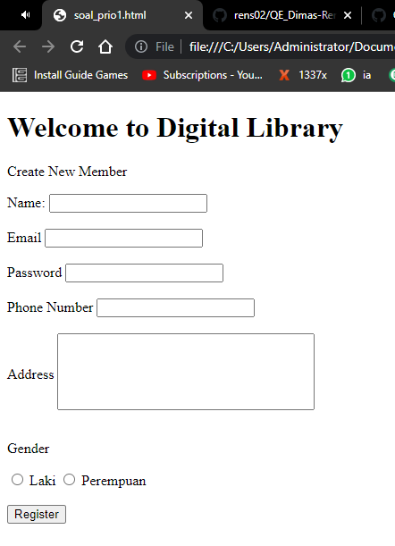

# Soal Prioritas 1 Web Programmin


# Soal WebTesting
Hasil Akhir


Cucumber File
```
@login
Feature: login
  As a user
  I want to see my home page
  So that I can update my profile

  @userA
  Scenario: As user i have be able to success login
    Given I am on the login page
    When I enter valid username
    And I enter valid password
    And I click login button
    Then I comeback to home page

  @userB
  Scenario: Problem User should be able to login
    Given I am on the login page
    When I enter problem username
    And I enter valid password
    And I click login button
    Then I comeback to home page

  @userC
  Scenario: As user i should not be able to login with invalid password
    Given I am on the login page
    When I enter valid username
    And I enter invalid password
    And I click login button
    Then I stay on the login page
```


Codingan
```
public class LoginSteps {
    @Steps
    Login login;

    @Steps
    Home home;

    @Given("I am on the login page")
    public void onTheLoginPage(){
        login.openUrl("https://www.saucedemo.com/");
        login.validateOnLoginPage();
    }
    @When("I enter valid username")
    public void enterValidUsername(){
        login.inputUsername("standard_user");
    }
    @And("I enter invalid password")
    public void enterInvalidPassword(){
        login.inputPassword("secret_sauce2222");
    }
    @And("I click login button")
    public void clickLoginButton(){
        login.ClickLoginButton();
    }
    @Then("I comeback to home page")
    public void onTheHomePage(){
        home.validateOnTheHomePage();
    }
    @Then("I stay on the login page")
    public void stayOnLogin(){
        home.validateNOTOnTheHomePage();
    }

    @When("I enter problem username")
    public void enterProblemUsername(){
        login.inputUsername("problem_user");
    }
    @And("I enter valid password")
    public void enterValidPassword(){
        login.inputPassword("secret_sauce");
    }

}

```