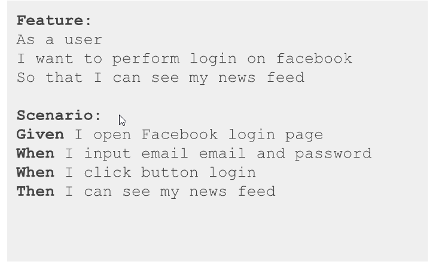
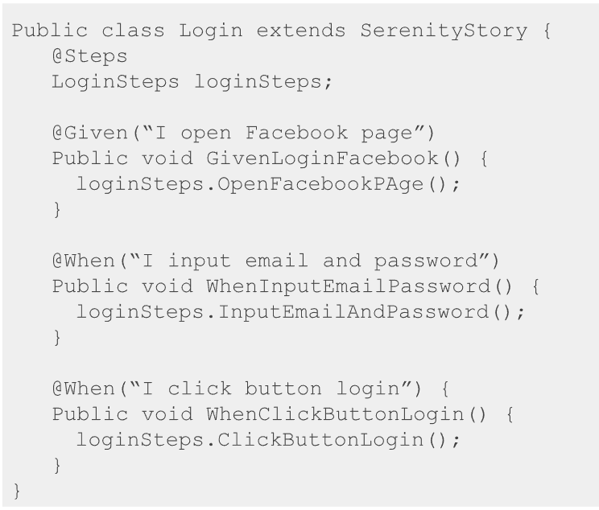
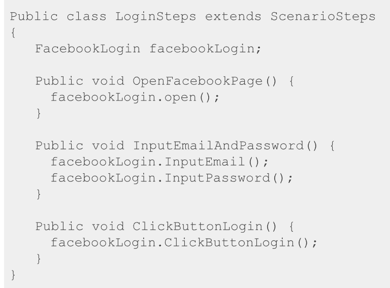
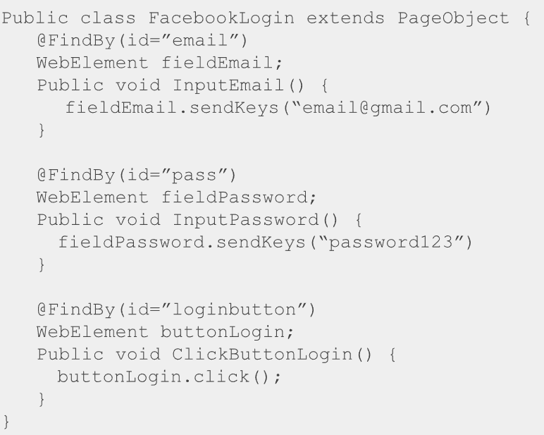

# Langkah- Langkah melakukan testing dengan serenity BDD
   1. Buat Test Story
    
   2. Buat Test Class
    
   3. Buat Test Steps
    
   4. Buat Page Objects
    
   5. Running dengan ```mvn clean verify```


# Hal-hal yang dibutuhkan untuk melakukan web testing with serenity adalah
   1. Maven
   2. Homebrew atau NodeJS (NPM)
   3. Google Chrome
   4. Intellij IDEA


# Untuk melakukan testing hanya pada tags yang diinginkan dapat digunakan
```
mvn verify -Dtags="@example"
```
