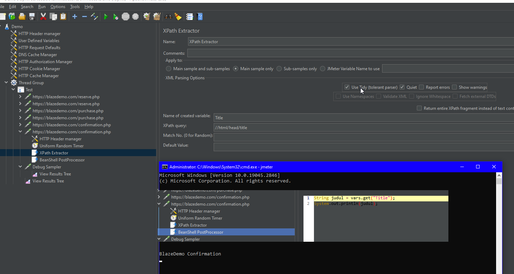

# Soal Fundamental Performance Testing
Sebutkan jenis-jenis performance test
    1. Load Test
    2. Stress Test
    3. Endurance Test
    4. Peak Test

# Soal Introduction & Tutorial Record with JMeter
```Mencari Penerbangan```

```Memilih jadwal terbang```

```Membeli tiket```


# Soal Post Processor & Understanding JMeter Result
```Post processor yang dipakai disini adalah XPATH extractor yang mengambil data yang ada pada XPATH yang ditentukan```

```Beanshell Post Processor digunakan untuk mencetak variabel judul yang berisikan title yang ada pada Head setelah dicari melalui XPATH Extractor```

