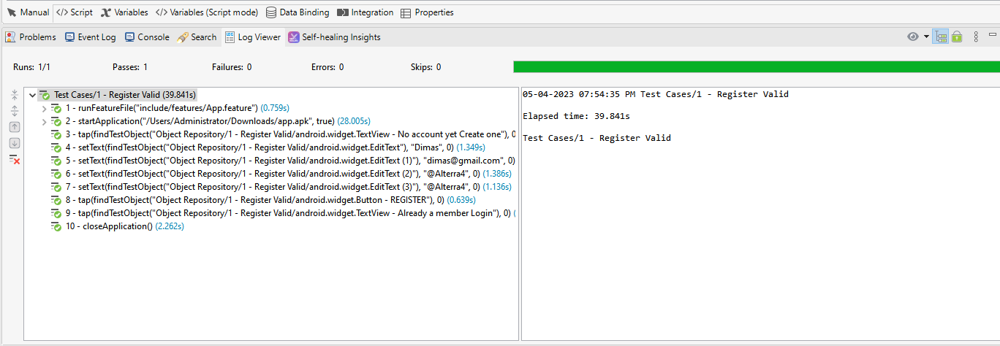
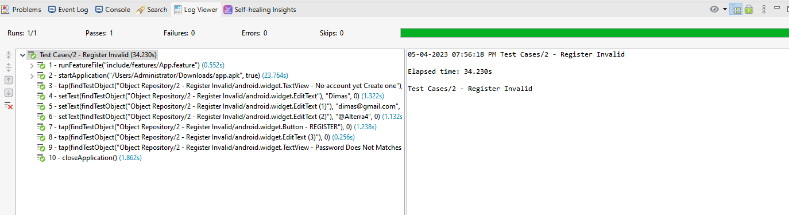

# Mobile Testing
## TC1
```
Scenario Outline: User want to register to app
     Given User open the app
     When User redirect to the register page 
     And User set() Name "<name>"
     And User set() Email "<email>"
     And User set() Password "<password>"
     And User set() Confirm Password "<confirm_password>"
     And User click() Register button 
     Then User registered to the app successfully 
```    

## TC2
```
Scenario Outline: User want to register to app invalid register with missing password field 
     Given User open in the app
     When User redirect in the register page 
     And User set() the Name "<name>"
     And User set() the Email "<email>"
     And User set() the Password "<password>"
     And User missed Password field
     And User click() the Register button
     Then User cannot successfully register to the app and get warning message to fill password 
``` 

## TC3
```
Scenario Outline: User want to login to app 
     Given User open in the aplikasi app 
     And User register to the app 
     When User has registered to sistem 
     And User redirect to login
     And User set() in the Email "<email>"
     And User set() in the Password "<password>"
     And User click() login button
     Then User logged in to the app successfully
``` 
 
## TC4
```
Scenario Outline: User want to login to app invalid credentials  
     Given User open the aplikasi app 
     And User register in the to app 
     When User has registered in to sistem 
     And User redirect in to login
     And User set() in Email "<email>"
     And User missed the Password field
     And User click() the login button
     Then User cannot logged in to the app successfully and get mesaage warning
  
```
 
## TC5
```
Scenario Outline: User to access dasboard
     Given User open aplikasi the app
     When User redirect register page 
     And User set() Name in the app "<name>"
     And User set() Email in the app "<email>"
     And User set() Password in the app "<password>"
     And User set() Confirm Password in the app "<confirmPassword>"
     And User click() in the register button
     When User successfully register redirect to login page 
     And User set() Email to app "<email>"
     And User set() Passowrd in the app "<password>"
     And User click() in the login button
     Then User can successfully go to dashboard 
```
 