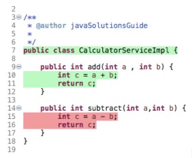
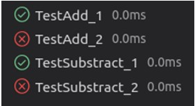

Soal Prioritas 1

1. Sebutkan dan jelaskan berbagai automation testing tool yang dapat digunakan (minimal 3)!

    Katalon adalah automation testing tool yang dapat digunakan untuk web, API,Windows program, dan aplikasi mobile. Katalon juga gratis dan sangat mudah digunakan karena minim coding

    Selenium adalah framework untuk automation testing pada web yang sangat populer, selenium juga open source yang berarti free

    Postman juga adalah salah satu automation testing tools populer yang digunakan untuk API testing, Postman apat digunakan untuk functional test, integration test, dan regression test. post man dapat dieksekusi secara automatis dengan command line

    Sumber : [https://katalon.com/resources-center/blog/automation-testing-tools](https://katalon.com/resources-center/blog/automation-testing-tools)

2. Simpulkan kode dibawah ini

Pada classs Calculator ada fungsi add dan substract yang memiliki integer a dan b sebagai parameternya, pada fungsi add integer C adalah integer a ditambah integer b setelah dilakukan kalkulasi fungsi add akan mengembalikan nilai C dan Pada fungsi subtract c adalah a dikurang b

Soal Prio 2

Untuk gambar diatas saya menyimpulkan bahwa gambar tersebut adalah hasil test unit kode java sebelumnya, dimana

TestAdd_1 dan TestAdd_2 menguji fungsi add dimana Hasil TestAdd_1 mengindikasikan test unit kasus pertama berhasil dan hasil TestAdd_2 mengindikasikan test unit kasus kedua tidak berhasil

Lalu TestSubstract_1 dan TestSubstract_2 menguji fungsi subtract dimana Hasil TestSubstract_1 mengindikasikan test unit kasus pertama berhasil dan hasil TestSubstract_2 mengindikasikan test unit kasus kedua tidak berhasil

 

**Soal Software Testing as a Career Path**

Sebutkan berbagai skill yang dibutuhkan untuk menjadi seorang software tester!

Non-Technical Skill:

* Analytical Skill
* Communicaation Skill
* Time Management & Organization Skill
* Great Attitude
* Passion

Technical Skill:

* Basic knowledge of Unix/Linux Commands
* Knowledge and hand-on experience on Test Management Tool
* Knowledge and hand-on experience on Automation Testing Tool