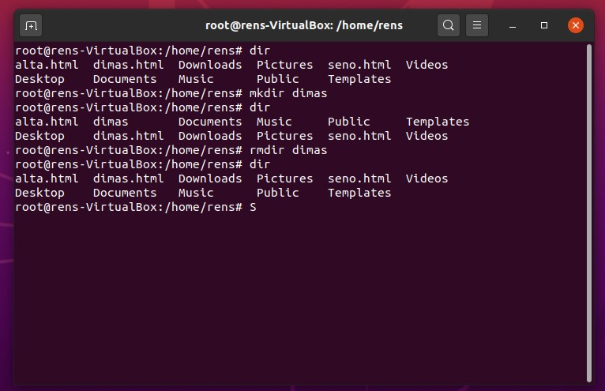
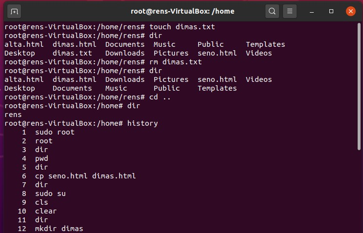
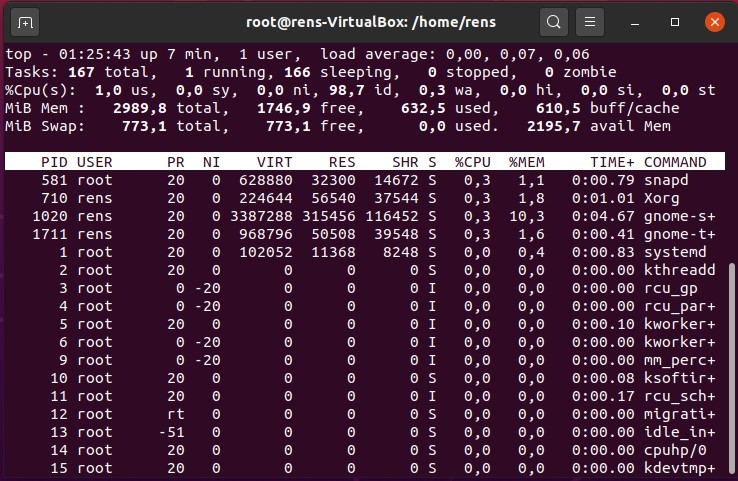
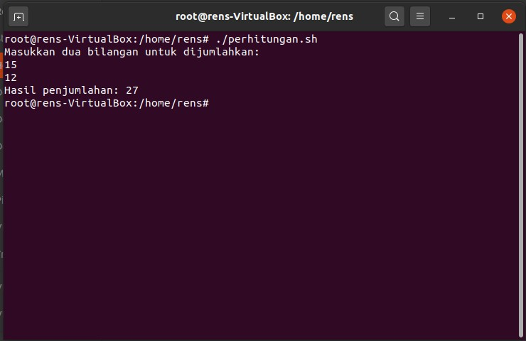

```
mkdir: Digunakan untuk membuat directory(folder) 
rmdir : digunakan untuk menghapus directory 
dir : digunakan untuk menampilkan isi pada directory aktif
```

```
touch : digunakan untuk membuat file baru bernama dimas.txt
rm: digunakan untuk menghapus file (bukan directory/folder)
cd: digunakan untuk mengatur directory aktif(paramete .. berarti back ke sebelum directory aktif)
```



```
touch digunakan untuk melihat seluruh proses yang berjalan dan melihat semua resource pada system
```


TUGAS 2 MEMBUAT PROGRAM SHELL

```
#!/bin/bash
echo "Masukkan dua bilangan untuk dijumlahkan:"
read bil1
read bil2
hasil=$(($bil1 + $bil2))
echo "Hasil penjumlahan: $hasil"
```
read digunakan untuk meminta input