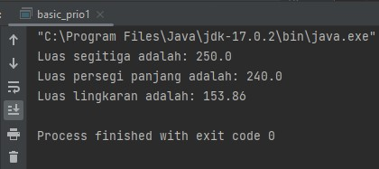
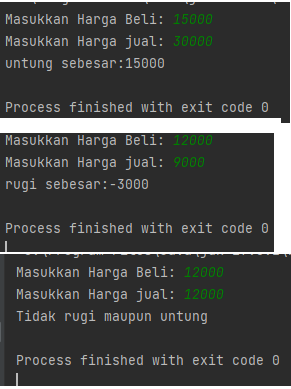
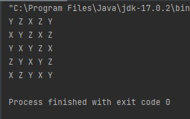
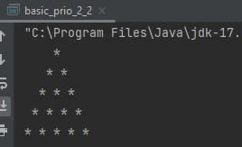
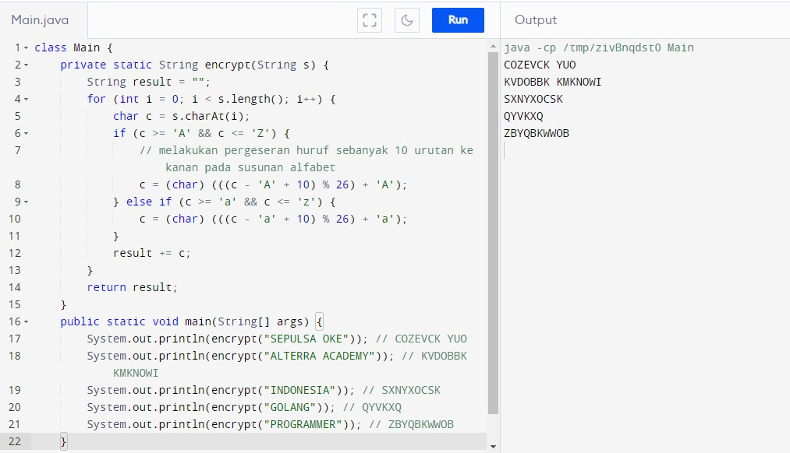
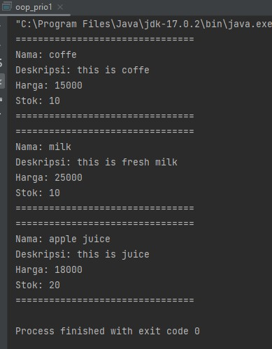

# BASIC PROGRAMMING
## TUGAS PRIORITAS 1
```
public class basic_prio1_1 {
    public static void main(String[] args) {


        // segitiga
        float alas = 20;
        float tinggi = 25;
        double outputSegitiga = (0.5 * alas * tinggi);
        System.out.println("Luas segitiga adalah: "+outputSegitiga);

        // TODO: hitung luas segitiga

        // persegi panjang
        float panjang = 40;
        float lebar = 6;
        double outputpPanjang = panjang * lebar;
        System.out.println("Luas persegi panjang adalah: "+outputpPanjang);

        //TODO: hitung luas persegi panjang

        // lingkaran
        double jari2 = 7;
        double phi = 3.14;
        double outputLingkaran = jari2 * jari2 * phi;
        System.out.println("Luas lingkaran adalah: "+outputLingkaran);
        //TODO: hitung luas lingkaran
    }
}
```

```
import java.util.Scanner;
public class basic_prio1_2 {
    public static void main(String[] args){
        Scanner scan = new Scanner(System.in);
        System.out.print("Masukkan Harga Beli: ");
        int hargaBeli = scan.nextInt();
        System.out.print("Masukkan Harga jual: ");
        int hargaJual = scan.nextInt();
        int hasilPenjualan = hargaJual - hargaBeli;
        if (hargaJual > hargaBeli){
            System.out.println("untung sebesar:"+hasilPenjualan);
        }else{
            if (hargaJual < hargaBeli){
                System.out.println("rugi sebesar:"+hasilPenjualan);
            }else{
                System.out.println("Tidak rugi maupun untung");
            }
        }
    }

}
```

## TUGAS PRIORITAS 2
```
public class basic_prio2_1 {
    public static void drawXYZ(int height) {
        int s = 0;
        for (int i = 0; i < height; i++) {
            for (int j = 0; j < height; j++) {
                s++;
                if (s % 3 == 0) {
                    System.out.print("X ");
                } else if (s % 2 == 1) {
                    System.out.print("Y ");
                } else {
                    System.out.print("Z ");
                }
            }
            System.out.println();
        }
    }

    public static void main(String[] args) {
        drawXYZ(5);
    }
}
```

```
public class basic_prio_2_2 {
    public static void printAsterisk(int n) {
        int space = n - 1;
        for (int i = 0; i < n; i++) {
            for (int j = 0; j < space; j++) {
                System.out.print(" ");
            }
            for (int j = 0; j <= i; j++) {
                System.out.print("* ");
            }
            System.out.println();
            space--;
        }
    }
    public static void main(String[] args) {
        printAsterisk(5);
    }
}
```

## TUGAS EKSPLORASI
```
class Main {
    private static String encrypt(String s) {
        String result = "";
        for (int i = 0; i < s.length(); i++) {
            char c = s.charAt(i);
            if (c >= 'A' && c <= 'Z') {
                // melakukan pergeseran huruf sebanyak 10 urutan ke kanan pada susunan alfabet
                c = (char) (((c - 'A' + 10) % 26) + 'A');
            } else if (c >= 'a' && c <= 'z') {
                c = (char) (((c - 'a' + 10) % 26) + 'a');
            }
            result += c;
        }
        return result;
    }

    public static void main(String[] args) {
        System.out.println(encrypt("SEPULSA OKE")); // COZEVCK YUO
        System.out.println(encrypt("ALTERRA ACADEMY")); // KVDOBBK KMKNOWI
        System.out.println(encrypt("INDONESIA")); // SXNYXOCSK
        System.out.println(encrypt("GOLANG")); // QYVKXQ
        System.out.println(encrypt("PROGRAMMER")); // ZBYQBKWWOB
    }
}
```



# OBJECT ORIENTED PROGRAMMING
## TUGAS PRIO 1

## TUGAS PRIO 2

