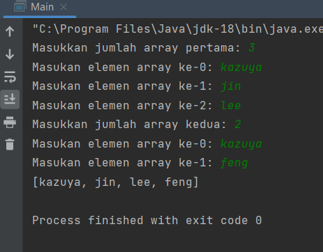
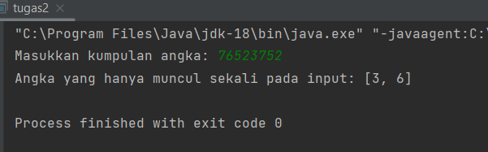
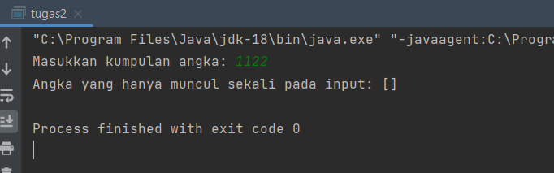
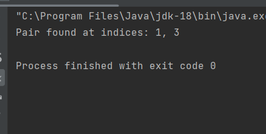
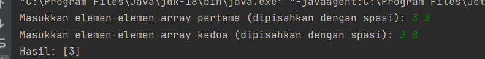
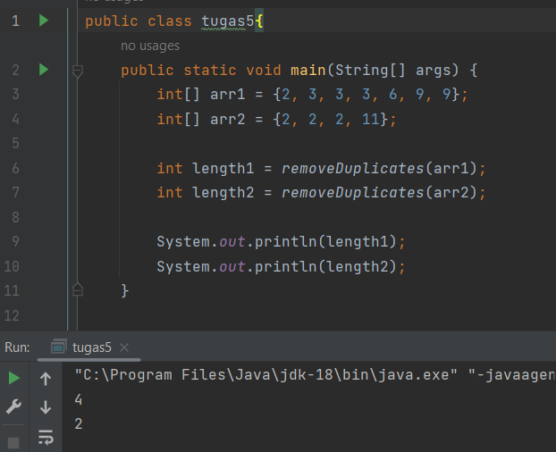

# Iterable AND Map Data Structure

## Tugas 1

**Sample Test Cases**
Input: ['kazuya', 'jin', 'lee'], ['kazuya', 'feng']
Output: ['kazuya', 'jin', 'lee', 'feng']
Input: ['lee', 'jin'], ['kazuya', 'panda']
Output: ['lee', 'jin', 'kazuya', 'panda']

```
import java.util.*;

public class tugas1{
    public static void main(String[] args) {

        Scanner input = new Scanner(System.in);

        // Read the size of the first array
        System.out.print("Masukkan jumlah array pertama: ");
        int size1 = input.nextInt();

        // Read the elements of the first array
        String[] array1 = new String[size1];
        for (int i = 0; i < size1; i++) {
            System.out.print("Masukan elemen array ke-"+i+": ");
            array1[i] = input.next();
        }

        // Read the size of the second array
        System.out.print("Masukkan jumlah array kedua: ");
        int size2 = input.nextInt();

        // Read the elements of the second array
        String[] array2 = new String[size2];
        for (int i = 0; i < size2; i++) {
            System.out.print("Masukan elemen array ke-"+i+": ");
            array2[i] = input.next();
        }

        String[] mergedArray = mergeArrays(array1, array2);

        System.out.println(Arrays.toString(mergedArray));

    }
    public static String[] mergeArrays(String[] arr1, String[] arr2) {
        HashSet<String> set = new HashSet<String>();
        ArrayList<String> mergedList = new ArrayList<String>();

        for (String element : arr1) {
            if (!set.contains(element)) {
                mergedList.add(element);
                set.add(element);
            }
        }

        for (String element : arr2) {
            if (!set.contains(element)) {
                mergedList.add(element);
                set.add(element);
            }
        }

        String[] mergedArray = new String[mergedList.size()];
        mergedList.toArray(mergedArray);

        return mergedArray;
    }

}
```




## Tugas 2

**Sample Test Case**
Input: “76523752”
Output: [6, 3]
Input: “1122”
Output: []

```
import java.util.*;

public class tugas2{
    public static void main(String[] args) {
        Scanner sc = new Scanner(System.in);
        System.out.print("Masukkan kumpulan angka: ");
        String input = sc.nextLine();

        Map<Character, Integer> map = new HashMap<>();
        List<Character> unique = new ArrayList<>();

        for (int i = 0; i < input.length(); i++) {
            char c = input.charAt(i);
            if (map.containsKey(c)) {
                map.put(c, map.get(c) + 1);
            } else {
                map.put(c, 1);
            }
        }

        for (char c : map.keySet()) {
            if (map.get(c) == 1) {
                unique.add(c);
            }
        }

        System.out.println("Angka yang hanya muncul sekali pada input: " + unique);
    }
}
```




## Tugas 3

```
public class tugas3 {

    public static void main(String[] args) {
        int[] sortedArray = {1, 2, 3, 4, 6};
        int targetSum = 6;
        int[] pairIndices = findPairIndices(sortedArray, targetSum);
        if(pairIndices == null) {
            System.out.println("No pair found.");
        } else {
            System.out.println("Pair found at indices: " + pairIndices[0] + ", " + pairIndices[1]);
        }
    }

    public static int[] findPairIndices(int[] sortedArray, int targetSum) {
        int left = 0;
        int right = sortedArray.length - 1;
        while(left < right) {
            int currentSum = sortedArray[left] + sortedArray[right];
            if(currentSum == targetSum) {
                return new int[]{left, right};
            } else if(currentSum < targetSum) {
                left++;
            } else {
                right--;
            }
        }
        return null;
    }
}
```

**Sample Test Cases**

Input: [1, 2, 3, 4, 6], target=6
Output: [1, 3]
Input: [2, 5, 9, 11], target=11
Output: [0, 2]


## Tugas 4

```
import java.util.ArrayList;
import java.util.Arrays;
import java.util.Scanner;

public class tugas4 {

    public static void main(String[] args) {
        Scanner input = new Scanner(System.in);
        System.out.print("Masukkan elemen-elemen array pertama (dipisahkan dengan spasi): ");
        String[] arr1String = input.nextLine().split(" ");
        int[] arr1 = new int[arr1String.length];
        for (int i = 0; i < arr1String.length; i++) {
            arr1[i] = Integer.parseInt(arr1String[i]);
        }

        System.out.print("Masukkan elemen-elemen array kedua (dipisahkan dengan spasi): ");
        String[] arr2String = input.nextLine().split(" ");
        int[] arr2 = new int[arr2String.length];
        for (int i = 0; i < arr2String.length; i++) {
            arr2[i] = Integer.parseInt(arr2String[i]);
        }

        int[] result = getUniqueElements(arr1, arr2);
        System.out.println("Hasil: " + Arrays.toString(result));
    }

    public static int[] getUniqueElements(int[] arr1, int[] arr2) {
        ArrayList<Integer> uniqueElements = new ArrayList<Integer>();
        for (int i = 0; i < arr1.length; i++) {
            boolean isDuplicate = false;
            for (int j = 0; j < arr2.length; j++) {
                if (arr1[i] == arr2[j]) {
                    isDuplicate = true;
                    break;
                }
            }
            if (!isDuplicate) {
                uniqueElements.add(arr1[i]);
            }
        }
        int[] result = new int[uniqueElements.size()];
        for (int i = 0; i < uniqueElements.size(); i++) {
            result[i] = uniqueElements.get(i);
        }
        return result;
    }
}
```

**Sample Test Case**
input: [1, 2, 3, 4] dan [1, 3, 5, 10, 16]
Output: [2, 4]
input: [3, 8] dan [2, 8]

Output: [3]


## Tugas 5

```
public class tugas5{
    public static void main(String[] args) {
        int[] arr1 = {2, 3, 3, 3, 6, 9, 9};
        int[] arr2 = {2, 2, 2, 11};

        int length1 = removeDuplicates(arr1);
        int length2 = removeDuplicates(arr2);

        System.out.println(length1);
        System.out.println(length2);
    }

    public static int removeDuplicates(int[] arr) {
        int index = 1;
        for (int i = 1; i < arr.length; i++) {
            if (arr[i] != arr[i-1]) {
                arr[index] = arr[i];
                index++;
            }
        }
        return index;
    }
}
```

Input: [2, 3, 3, 3, 6, 9, 9]
Output: 4
Explanation: The first four elements after removing the duplicates will be [2, 3, 6, 9].
Sample Test Case
Input: [2, 2, 2, 11]
Output: 2


