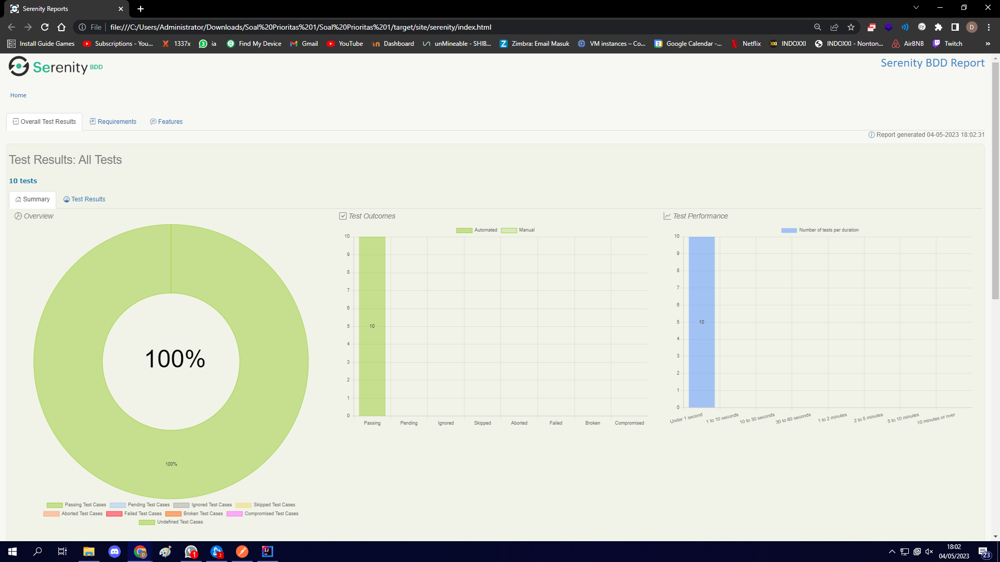
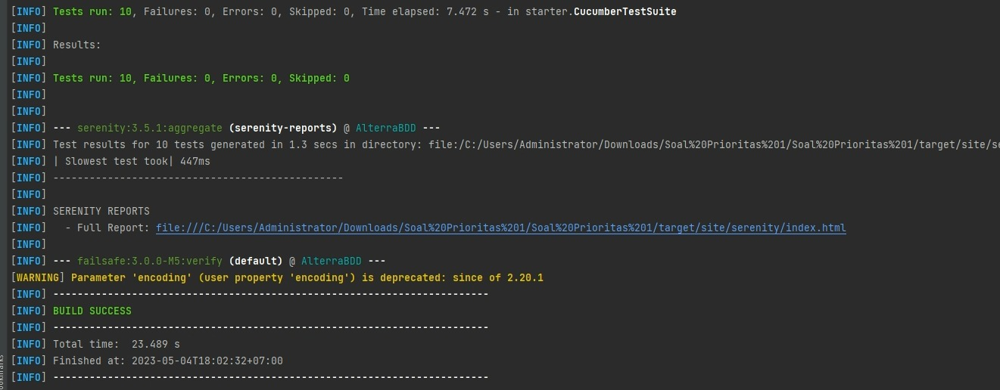

# SOAL FROM MANUAL TO AUTOMATION
Sebutkan jenis-jenis performance test
    1. Load Test
    
    
    2. Stress Test
    
    
    3. Endurance Test
    
    
    4. Peak Test
    
    
 Sebutkan 3 macam tools untuk melakukan performance test
 
    1. Jmeter
    2. BlazeMeter
    3. LoadNinja   
# SOAL PRIO 1 BDD

